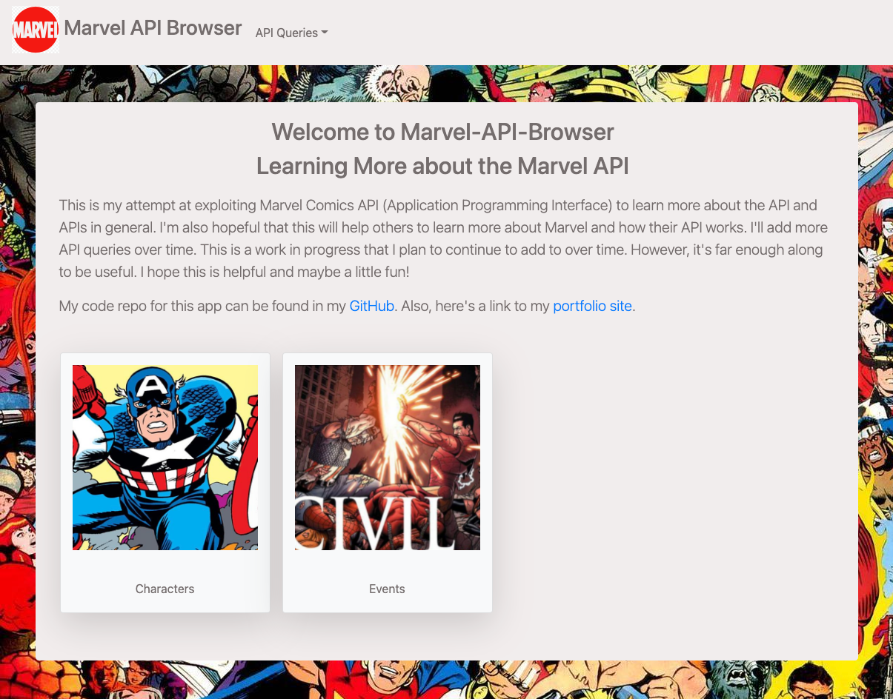

# marvel-mania

marvel-mania is an application that explores the Mavel Comics API.  I'm using it to not only learn more about APIs, but also to build my React coding skills.  This app is still a work in progress, but it's far enough along for it to be useable.

## Deployed Application
https://marvel-mania-2021.herokuapp.com/

## GitHub

https://github.com/swillrich5/marvel-mania

---
## Table of Contents

* [Installation](#installation)

* [Usage](#usage)

* [Technology](#technology)

* [Application Image](#Application-Image)

* [License](#license)

* [Contributing](#Contributing)

* [Questions](#Questions)

---

## Installation

If you wish to run your own copy of the application, please clone the repo and install the required node modules by running:

```
npm i
```

---

## Usage

After installing the required npm modules, the application can be started and run locally by entering:

```
npm start
```
from the command line.  

---

## Technology

The following technology was used to build note-taker:

  * node - https://nodejs.org/en/

  * react - https://www.npmjs.com/package/react

  * Bootstrap v4.6 - https://getbootstrap.com/docs/4.6/getting-started/introduction/


---

## Application-Image



---


## License

None

---

## Contributing

Please report any issues using my contact information below.

---

## Questions

GitHub Profile: https://github.com/swillrich5

Email Address: swillrich@gmail.com
